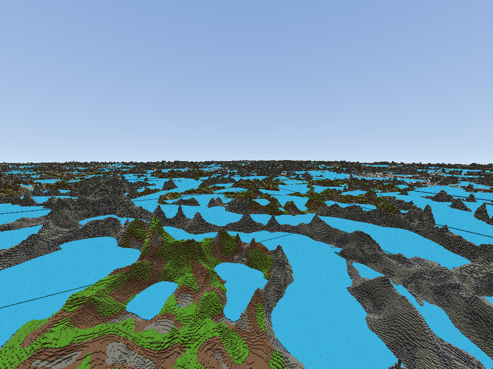
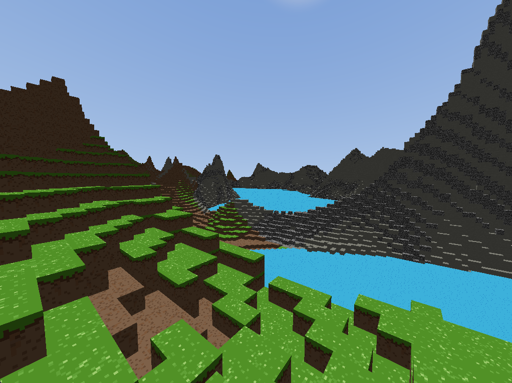
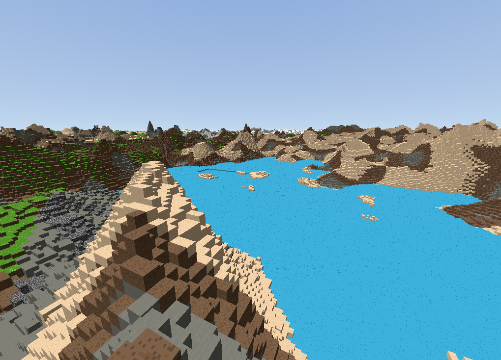

# Manifold

A from-scratch voxel engine built with **Rust** and **Vulkan**, designed with VR in mind.





## Features

- **Chunk-based world** -- 16x16x16 chunks with dynamic loading/unloading around the player
- **Procedural terrain** -- Perlin noise heightmap generation
- **Directional lighting** -- Lambertian diffuse + ambient, with palette-based materials
- **Hidden-face culling** -- cross-chunk boundary culling for efficient meshing
- **Player physics** -- gravity, collision, jumping, fly/walk toggle

## Architecture

```
src/
  graphical_core/   Vulkan renderer, pipeline, descriptors, shaders
  voxel/            Chunks, meshing, terrain generation, materials
  shaders/          GLSL vertex + fragment shaders (SPIR-V compiled)
```

Voxel data and rendering are fully decoupled. Materials use a 256-entry GPU palette (color, roughness, emissive) rather than per-vertex colors.

## Build

Requires the [Vulkan SDK](https://vulkan.lunarg.com/) and `glslc` on PATH.

```
cargo run
```

## Controls

| Key | Action |
|-----|--------|
| WASD | Move |
| Mouse | Look |
| Space | Jump (walk mode) |
| E / Q | Fly up / down |
| F | Toggle fly/walk |
| Esc | Release cursor |
