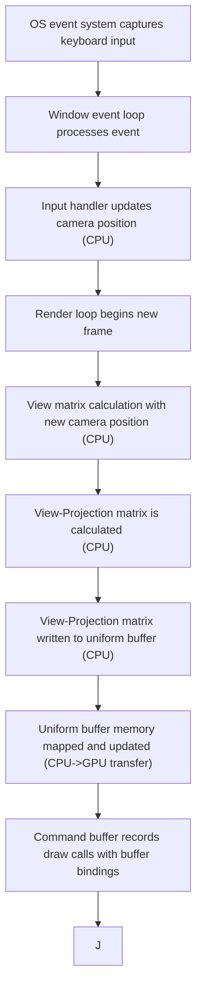

```mermaid
graph TD
    A["OS event system captures keyboard input"] --> B["Window event loop processes event"]
    B --> C["Input handler updates camera position <br/>(CPU)"]
    C --> D["Render loop begins new frame"]
    D --> E["View matrix calculation with new camera position <br/>(CPU)"]
    E --> F["View-Projection matrix is calculated <br/>(CPU)"]
    F --> G["View-Projection matrix written to uniform buffer <br/>(CPU)"]
    G --> H["Uniform buffer memory mapped and updated <br/>(CPU->GPU transfer)"]
    H --> I["Command buffer records draw calls with buffer bindings"]
    I --> J
```