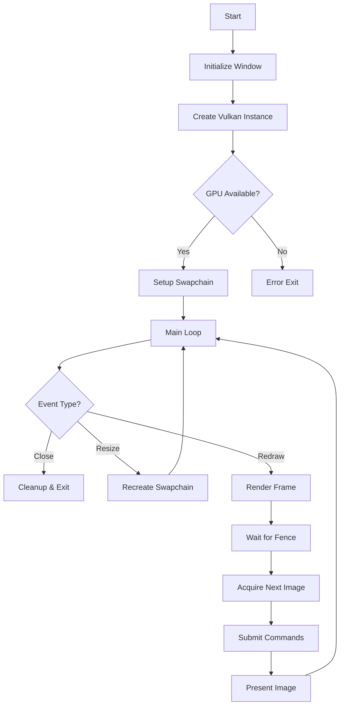

## System Architecture

```mermaid
graph TD
    A[Start] --> B[Initialize Window]
    B --> C[Create Vulkan Instance]
    C --> D{GPU Available?}
    D -->|Yes| E[Setup Swapchain]
    D -->|No| F[Error Exit]
    E --> G[Main Loop]
    
    G --> H{Event Type?}
    H -->|Close| I[Cleanup & Exit]
    H -->|Resize| J[Recreate Swapchain]
    H -->|Redraw| K[Render Frame]
    
    K --> L[Wait for Fence]
    L --> M[Acquire Next Image]
    M --> N[Submit Commands]
    N --> O[Present Image]
    O --> G
    
    J --> G
```